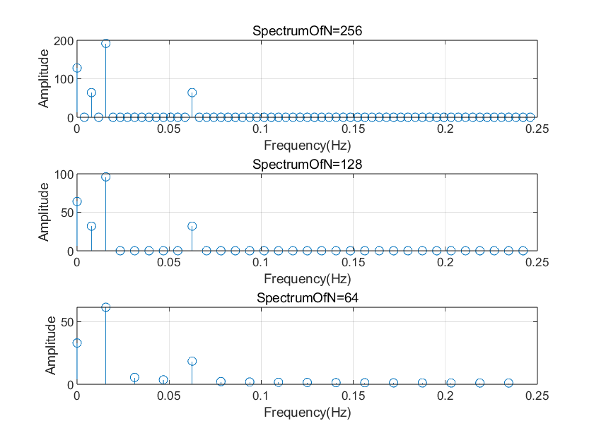
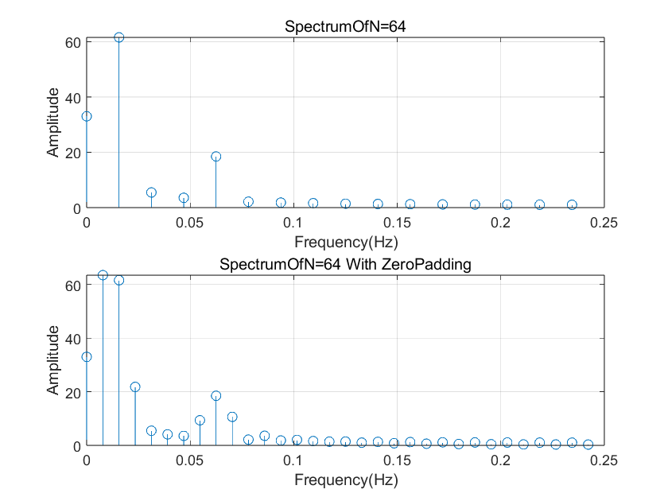
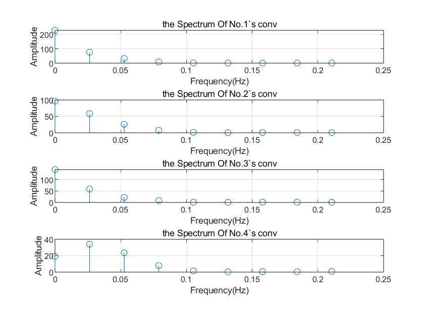

# DSP Lab 2 FFT

## 1 画出三个信号的频谱

结果如下

<center></center>

可以发现随着信号的长度变化，频谱的长度也变化了，如果是完整的频谱，那么频谱的长度等于信号的长度


## 2 给64s的信号补0

结果如下

<center></center>

补零之后频谱变长，相当于增加了在DTFT的结果上的采样密度，这里增加了一倍，能够采集到更多的频率信息


## 3 信号截断后卷积的频谱

结果如下

<center></center>

可以发现频谱不相同，发生了频谱泄露

原因在于时域的窗相当于在频域内卷积一个$\mathsf{sinc}$函数


## 4 思考题

### 4.1 截断长度的最小值

由于这个信号的$\Delta F_{\min} = \frac{4}{512}\mathsf{Hz}=0.0078125\mathsf{Hz}$，那么为了区分信号，最短的阶段长度应该是
$$
L = \frac{1}{\Delta F_{\min}} = 128
$$
这在实验一的结果中也能看到，在$N=64$时，$\cos\left(2\pi \cdot\frac{4}{512}t\right)$的频谱消失了

但是呢由于采样频率是$0.5$Hz，那么离散频率就是$\frac{4\times 2}{512}$，所以在信号点的个数上来说，应该是$N=64$是最小长度，$N=32$的频谱有信号消失


### 4.2 补0的作用

看实验二，补0相当于DFT在DTFT的频谱上增加了采样点，频谱信息更完整


## 5 源代码

```matlab
% 采样频率
fs = 0.5; % Hz
Ts = 1/fs; % 采样周期

% 定义时间向量
t_256 = 0:Ts:256-Ts;
t_128 = 0:Ts:128-Ts;
t_64 = 0:Ts:64-Ts;

% 生成原始信号
sig_256 = generateSignal(t_256);
sig_128 = generateSignal(t_128);
sig_64 = generateSignal(t_64);

% 绘制图一：不同长度信号的频谱
figure(1);
plotSpectrum(sig_256, fs, 'SpectrumOfN=256', 3, 1, 1);
plotSpectrum(sig_128, fs, 'SpectrumOfN=128', 3, 1, 2);
plotSpectrum(sig_64, fs, 'SpectrumOfN=64', 3, 1, 3);

% 补零处理并绘制图二
figure(2);
subplot(2,1,1);
plotSpectrum(sig_64, fs, 'SpectrumOfN=64', 2, 1, 1);

sig_64ZeroPadding = [sig_64, zeros(1, 32)];
subplot(2,1,2);
plotSpectrum(sig_64ZeroPadding, fs, 'SpectrumOfN=64 With ZeroPadding', 2, 1, 2);


% 信号分段和卷积
h = [1, 1, 1, 1];
segments = {};
segments{1} = sig_128(1:16); % 每段16点
segments{2} = sig_128(17:32);
segments{3} = sig_128(33:48);
segments{4} = sig_128(49:64);

% 绘制图三：分段卷积后的频谱
figure(3);
for i = 1:4
    seg_conv = conv(segments{i}, h);
    plotSpectrum(seg_conv, fs, sprintf('the Spectrum Of No.%d`s conv', i), 4, 1, i);
end


function signal = generateSignal(t)
    signal = 1 + 3*sin(2*pi*8*t/512) + cos(2*pi*4*t/512) + sin(2*pi*32*t/512);
end


function plotSpectrum(sig, fs, titleStr, m, n, p)
    N = length(sig);
    f = (0:N/2-1)*fs/N;
    Y = fft(sig)/2;
    subplot(m, n, p);
    stem(f, 2*abs(Y(1:N/2)));
    xlim([0 0.25]);
    title(titleStr);
    xlabel('Frequency(Hz)');
    ylabel('Amplitude');
    grid on;
end
```

