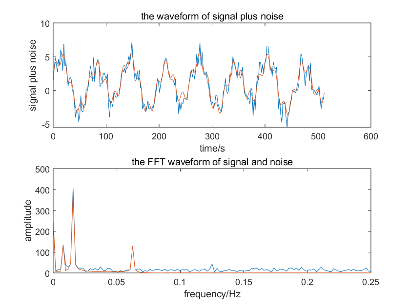
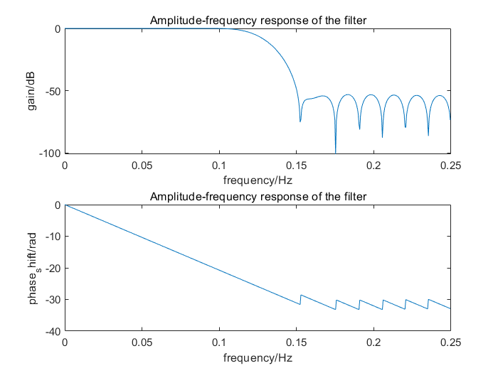
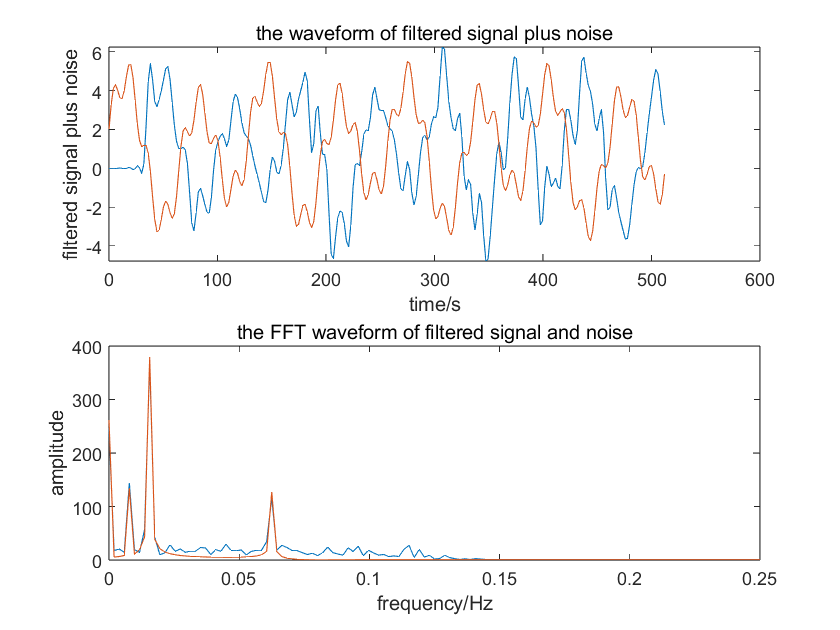
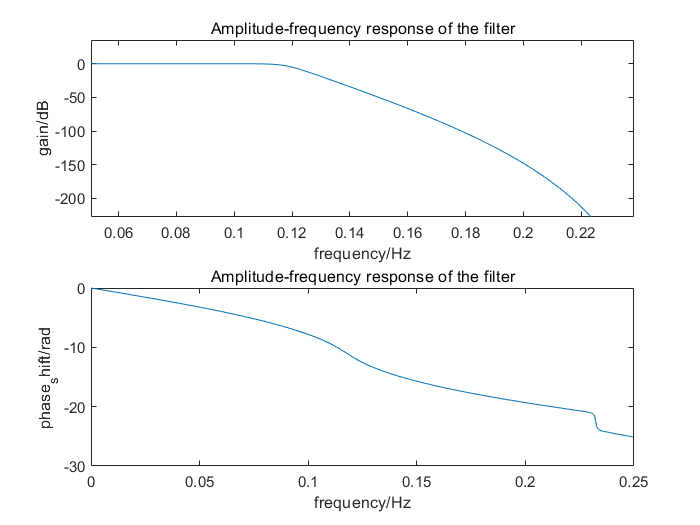
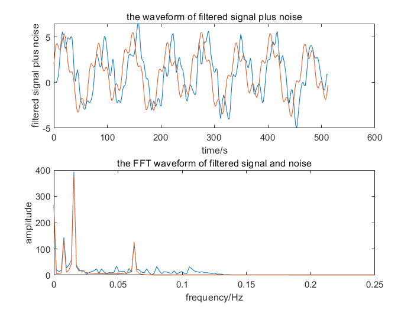

# Lab 3

### 1 信号时域波形和频谱

如下图

<center></center>

图中蓝线为加噪信号，红线为原始信号，下同，不赘述

可以看到噪声的高频信号对频谱的高频部分造成了很大的影响，导致时域信号出现了很大的偏差，频域噪声分布比较均匀，但是由于原信号的高频成分很少，导致最终信号高频被污染


### 2 FIR滤波器设计

根据通带波纹和阻带衰减，确定使用Hamming窗，通过过渡带宽的计算（见代码）得到窗的长度`N = ceil(3.3*2*pi/deltaW) = 34`，由于奇偶数的滤波器都能做到低通，故这里不向上取奇数即`N = 35`了

调包计算得到滤波器幅/相频特性如下

<center></center>

可以发现在通带内是线性相位，这就够了，阻带的衰减具体而言是-53dB，由Hamming窗的特性决定，通带波纹也是达标的


### 3 FIR过滤后的信号

直接调包计算，得到过滤后的波形为

<center></center>

观察时域信号，发现存在常数的时延，这和上面的线性相位对应，且波形更接近原信号了，也就是高频的噪声明显减少

观察频域信号，高频信号明显减少，但是低频噪声无法滤过，这是正常的，在过渡带宽的噪声因为衰减不够也有一定保留


### 4 IIR滤波器设计

这里没有给出$A_p$的模拟指标，只能用`buttord`函数进行阶数和截止频率的计算

```matlab
[N1, Wc2] = buttord(wlp, wls, Ap, As, 's');
[z, p] = butter(N1, Wc2, 'low', 's');
[b, a] = bilinear(z, p, fs);
```

这里用的函数都是模拟的，所以不用归一化，直接写模拟值就行

最终得到的IIR滤波器的幅/相频特性如下

<center></center>

阻带衰减恰好为-50dB，非常准确，通带波纹是远大于-0.02dB的，也就是说限制了阶数不能减少的原因是阻带衰减，可以发现相位不是线性的，但是在通频带是近似于线性的


### 5 IIR滤波后的信号

直接调包，得到过滤后的波形为

<center></center>

可以发现，虽然不是线性相位，但是由于在通带是接近线性，故整体上看信号也是差不多一个固定的时延

IIR比FIR的截止频率更加准确，在图上表现为过渡带的频率分量减少，且减小更快了，IIR压高频也更狠；但是要是给了$A_p$就能做的更准确，可惜没有给


### 6 CODE

源代码如下

```matlab
% 设置参数
length = 256;
fs = 0.5;
t = linspace(0, length / fs, length);
noise = randn(1, length);
signal = 1 + 3*sin(2*pi*8/521*t) + cos(2*pi*4/512*t) + sin(2*pi*32/512*t);
signal_and_noise = signal + noise;
S = abs(fft(signal));
S = S(1:length/2+1);
% 滤波器的模拟要求
flp = 0.1;
fls = 0.15;
fhs = 0.2;
As = -50;
Ap = -0.02;
% 第一张图
figure;
subplot(2, 1, 1);
plot(t, signal_and_noise, t, signal);
title('the waveform of signal plus noise');
xlabel('time/s');
ylabel('signal plus noise');

S_a_N = abs(fft(signal_and_noise));
S_a_N = S_a_N(1:length/2+1);
f = fs * (0:(length/2))/length;
subplot(2, 1, 2);
plot(f, S_a_N, f, S);
title('the FFT waveform of signal and noise');
xlabel('frequency/Hz');
ylabel('amplitude');

% 1. 窗函数法FIR滤波器
% 根据通带波纹和阻带衰减，选择Hamming窗
deltaW = 2*pi*(fls-flp)/fs;
N = ceil(3.3*2*pi/deltaW);
Wc = (flp+fls)/2/fs*2*pi;
B = fir1(N-1, Wc/pi, "low", hamming(N));
[ham_filter, f1] = freqz(B, 1, 512, fs);
% 第二张图
figure;
% 幅频响应
subplot(2, 1, 1);
plot(f1, 20*log10(abs(ham_filter)));
title('Amplitude-frequency response of the filter');
xlabel('frequency/Hz');
ylabel('gain/dB');
% 相频响应
subplot(2, 1, 2);
plot(f1, unwrap(angle(ham_filter)));
title('Amplitude-frequency response of the filter');
xlabel('frequency/Hz');
ylabel('phase_shift/rad');
% 滤波
lp_filtered_signal = filter(B, 1, signal_and_noise, []);
% 第三张图
figure;
subplot(2, 1, 1);
plot(t, lp_filtered_signal, t, signal);
title('the waveform of filtered signal plus noise');
xlabel('time/s');
ylabel('filtered signal plus noise');

S_a_N_f = abs(fft(lp_filtered_signal));
S_a_N_f = S_a_N_f(1:length/2+1);
subplot(2, 1, 2);
plot(f, S_a_N_f, f, S);
title('the FFT waveform of filtered signal and noise');
xlabel('frequency/Hz');
ylabel('amplitude');


% 2. IIR滤波器
% 使用双线性变换法
wlp = 2*fs*tan(2*pi*flp/fs/2);
wls = 2*fs*tan(2*pi*fls/fs/2);
whs = 2*fs*tan(2*pi*fhs/fs/2);
% 没给通带衰减，用buttord计算，都用的模拟量
[N1, Wc2] = buttord(wlp, wls, Ap, As, 's');
[z, p] = butter(N1, Wc2, 'low', 's');
[b, a] = bilinear(z, p, fs);
[hz, f2] = freqz(b, a, 512, fs);
% 第四张图
figure;
% 幅频响应
subplot(2, 1, 1);
plot(f2, 20*log10(abs(hz)));
title('Amplitude-frequency response of the filter');
xlabel('frequency/Hz');
ylabel('gain/dB');
% 相频响应
subplot(2, 1, 2);
plot(f2, unwrap(angle(hz)));
title('Amplitude-frequency response of the filter');
xlabel('frequency/Hz');
ylabel('phase_shift/rad');

% 滤波
IIR_filtered_signal = filter(b, a, signal_and_noise, []);
% 第五张图
figure;
subplot(2, 1, 1);
plot(t, IIR_filtered_signal, t, signal);
title('the waveform of filtered signal plus noise');
xlabel('time/s');
ylabel('filtered signal plus noise');

S_a_N_IIR = abs(fft(IIR_filtered_signal));
S_a_N_IIR = S_a_N_IIR(1:length/2+1);
subplot(2, 1, 2);
plot(f, S_a_N_IIR, f, S);
title('the FFT waveform of filtered signal and noise');
xlabel('frequency/Hz');
ylabel('amplitude');
```

